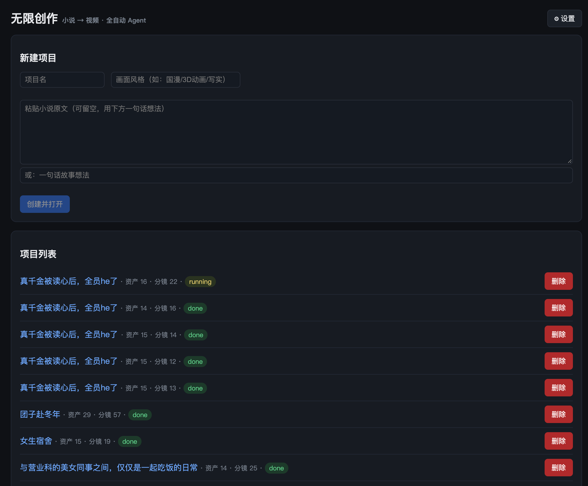
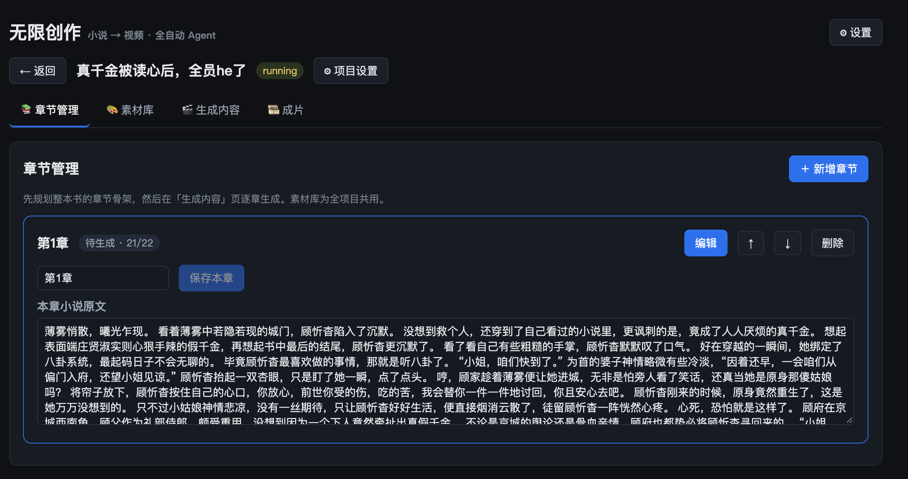
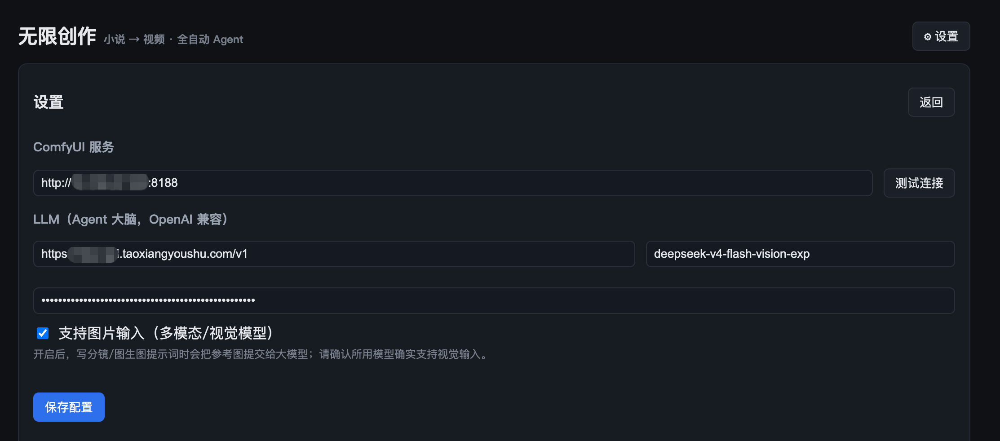
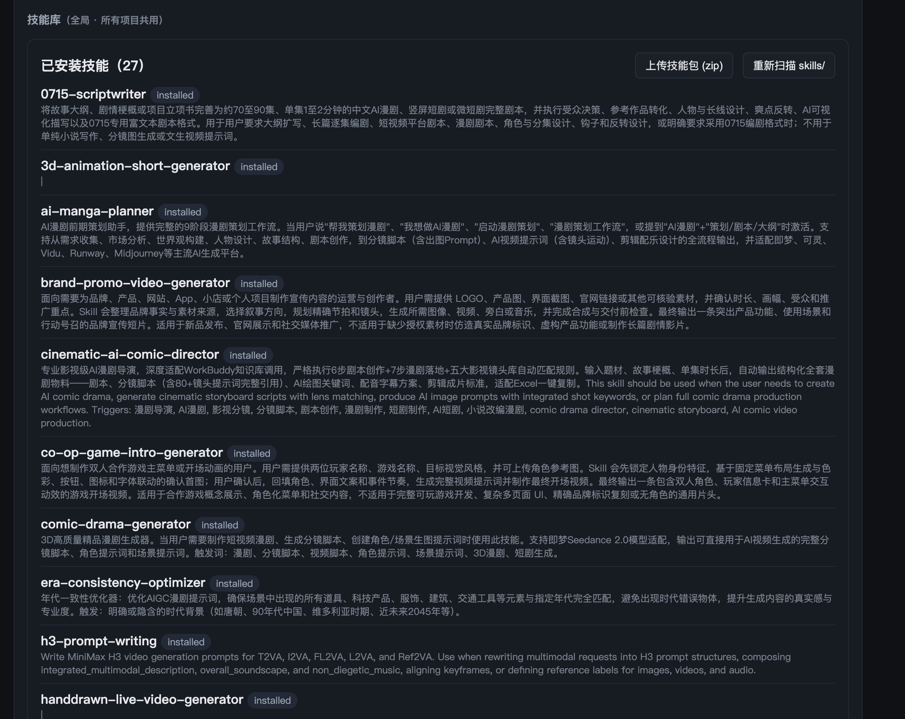
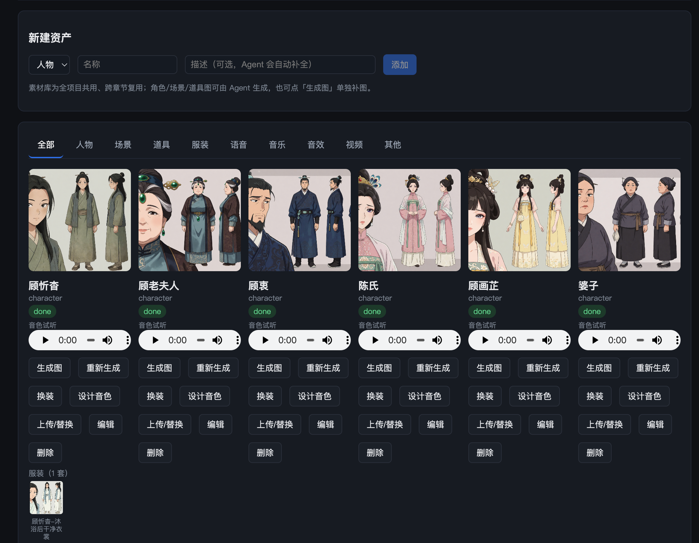
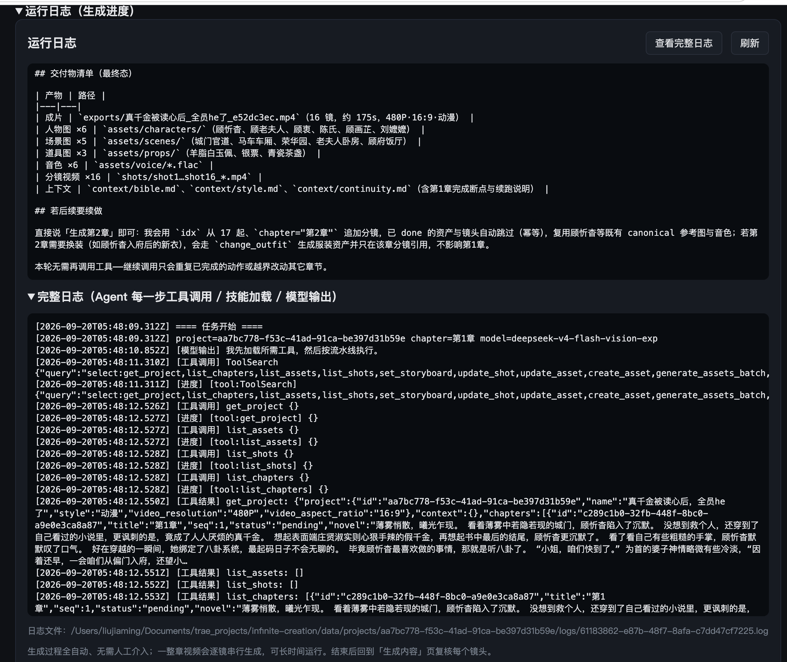
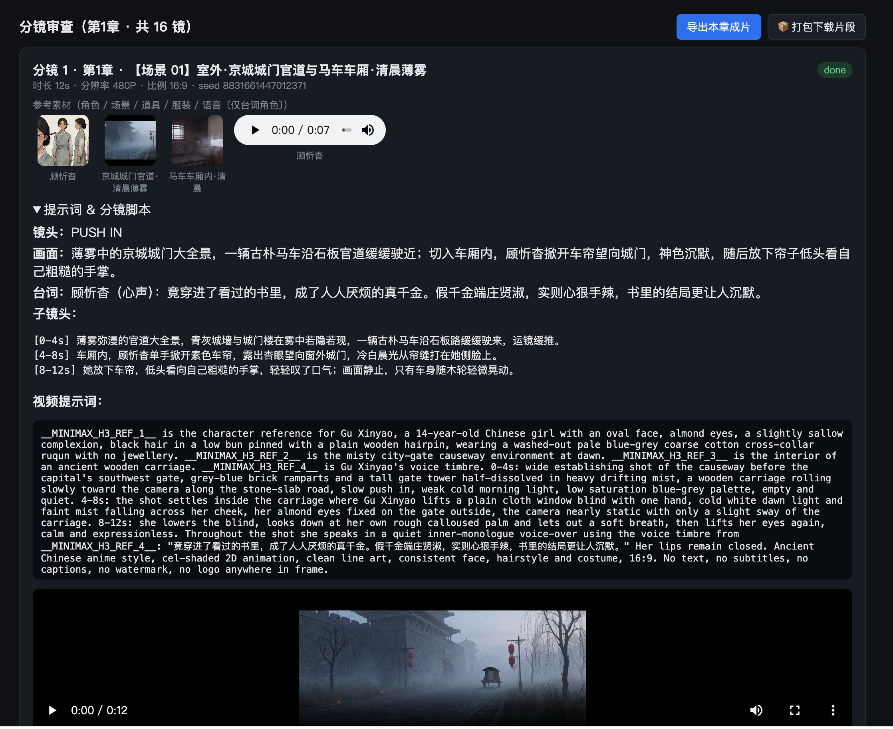
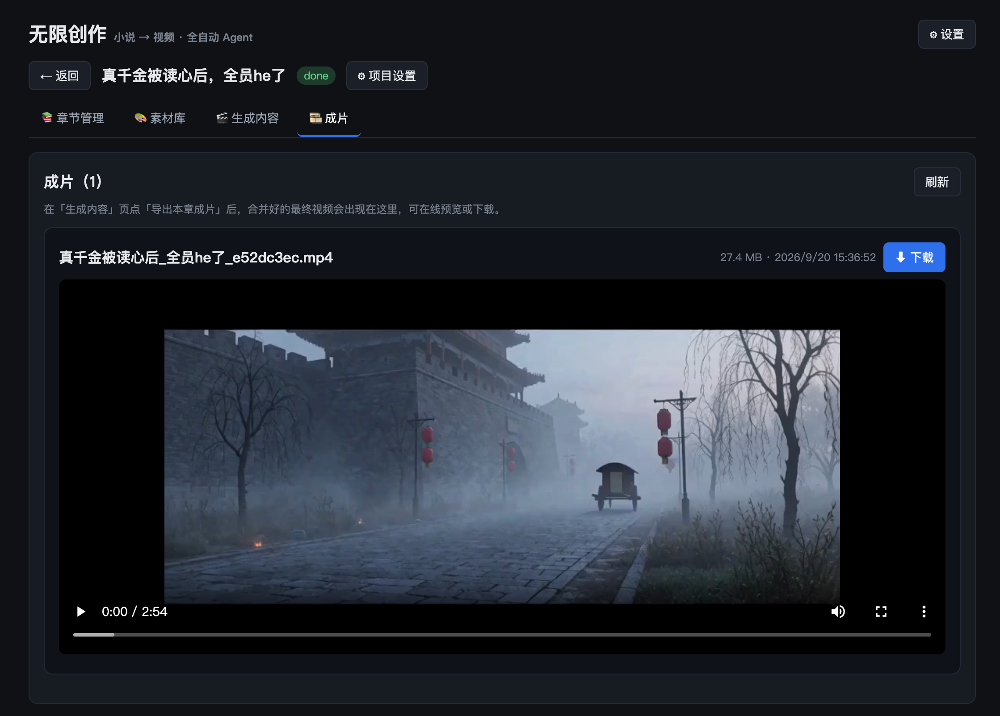

# Agent无限创作 · infinite-creation


## 项目简介
 **小说一键生成视频，不限时长，输入小说/剧本通过本地ComfyUI-MiniMaxH3+Agent+Skill技能一键全自动无限生产视频**

## 生成样例
- 《妈妈的时间》
<div align="center">
  <video src="https://github.com/user-attachments/assets/3ace95ff-1ec1-46b0-abab-115c76734ee3" width="70%" poster=""> </video>
</div>

[更多样例](docs/run_demo.md)

## 项目计划
- [计划中] 前端页面整理及美化
- [✅] 支持提交参考素材，及Agent整理参考素材
- [计划中] 接入Seedance、kling、wan、MiniMax-H3在线版Api接口一键生成视频
- [进行中] 接入在线RunningHub-ComfyUI工作流生成，会员MiniMax-H3夜间免费运行
- [✅] 优化本地MiniMax H3人物语音电流声或者语音不清晰的问题
- [✅] 上传小说/剧本生成视频本地全链路Agent全自动工作流生成方案
- [✅] 优化图片素材生成的质量
- [✅] 优化人物参考音频的声音设计
- [✅] 支持人物服装管理，每个人物可以支持设计多套服装

## 项目宗旨
提供Agent生成视频全链路整合方案

## 项目架构
基于**本地 ComfyUI**（MiniMax H3 视频 GGUF 版 + Qwen-Image 2.1 文生图/图生图 + Krea2 文生图 + Qwen3-TTS）的**全自动「小说/剧本 → 视频」Agent 工作流**。项目目前整理了27个Skill技能，其中包含MiniMax-H3提示词优化，分镜剧本生成，小说转剧本等。

只要把一部小说/剧本粘贴进项目，点一下「开始」，Agent 会全自动完成：

> 剧本/大纲 → 人物圣经 + 风格指南（一致性锚点）→ 人物/场景/道具/语音资产生成 → 分镜脚本 → 逐镜视频（MiniMax H3 Ref2VA）→ 自审重试 → ffmpeg 合并成片。

**全程无需人工介入**，可以长时托管无需人工干预运行（跑一晚/一整天均可）；完成后可逐段**审查分镜**并对不满意的片段**单独重生成**。

## 我的电脑运行配置
```text
系统：Windows 11（也支持在Linux/Mac上运行）
CPU：12th Gen Intel(R) Core(TM) i5-12400F
显卡：NVIDIA GeForce RTX 3080 20G 
内存：32GB DDR4 3200 MT/s (16GBx2)
```
**具体本地的显卡配置需要多大的显存，我这边暂时还没有做详细测试，如果有相关测试的结果，欢迎加入群聊分享，理论上来说8GB以上显存都是可以运行的**

**注意**：须先安装ffmpeg，否则可能会影响最后的合并成片的功能，下载地址：[https://ffmpeg.org/download.html](https://ffmpeg.org/download.html)

## 核心能力

- **无限视频时长**：支持生成任意时长的视频，无需手动调整分镜脚本或视频参数，上传小说/剧本自动生成长视频。
- **自动分镜**：根据人物动作、场景变化、道具移动等自动分镜，无需人工干预。
- **项目隔离**：每个项目的素材文件 + Agent 上下文（人物圣经/风格指南/连续性记录）完全隔离，资源按分类整理（人物/场景/道具/语音/音乐/音效/其他）。
- **人物一致性**：每人物一张 canonical 参考图跨分镜复用 + 统一外观描述 + H3 参考标签规则。
- **技能系统**：默认预装 MiniMax-H3 视频Skill技能 + 本项目 novel-to-video 主技能；支持把 SKILL.md 丢进 skills/ 目录扩展。
- **自迭代（技能工厂）**：上传一个新的 ComfyUI 工作流 JSON，自动解析节点 → 生成工作流规格 + 起草对应技能，Agent 立即可调用。
- **断点续跑**：任务持久化 + 幂等跳过，进程崩溃/重启后可继续，不重复生成。
- **审查/重生成**：分镜级预览与重生成（换种子 / 按反馈改写提示词）。
- **分阶段运行**：生成拆成 文本创作 / 资产生图 / 音色设计 / 分镜视频 四个独立阶段，可任意勾选单独跑或续跑 —— 按显存约束自动拆批，不需要的阶段不拉起对应进程。
- **显存维护**：设置页可配「每 N 个生成后自动释放 ComfyUI 显存」（默认 3，0 = 关闭），覆盖文生图/图生图/换装/音色/视频全部渲染——AMD Dynamic VRAM 的显存累积不只在视频触发；未启用 Dynamic VRAM 时界面会提示关闭。
- **在线预览**：成片/分镜视频经后端 Range 流式传输，进度条可随意拖动、即时跳转。

# 截图演示

1. 项目首页
   
2. 章节管理
   
3. 服务配置
   
4. 技能管理
   
5. 资产管理
   
6. 运行日志
   
7. 分镜审查
   
8. 导出成片
   

## 技术栈

- 后端：Node.js（Next.js 自定义 server）+ node:sqlite + ComfyUI REST/WebSocket + ffmpeg，零原生编译依赖。
- Agent：自研 ReAct 循环（原生 function-calling，JSON 动作块兜底），工具注册表 + 技能引擎 + 技能工厂。
- 前端：Next.js 15 + React 18（App Router）。
- 结构：单包 —— `app/`（页面 + 30+ 个 API 端点）· `lib/`（core/agent/shared 复用逻辑）· `server.js`（自定义 server：WebSocket 进度推送 + `/files` 静态托管，支持 Range 流式播放视频）。

## 目录结构

```
infinite-creation/
├── app/                 # Next.js App Router（页面 + API 端点）
├── lib/                 # 复用逻辑：core（ComfyUI/LLM/DB/ffmpeg）· agent（运行时+技能）· shared（常量）
├── server.js            # 自定义 server（WebSocket 进度推送 + /files 静态托管，Range 流式）
├── workflows/           # ComfyUI 工作流模板（MiniMax H3 视频 / Qwen-Image 2.1 图·文 / Krea2 / Qwen3-TTS，含 GGUF 量化版）
├── start-infinite-creation.bat    # Windows 一键后台启动（自动装依赖 + 等服务就绪）
├── stop-infinite-creation.bat     # Windows 停止服务
├── skills/              # 技能库（9 官方 + novel-to-video + 自定义）
├── scripts/install-skills.mjs   # 拉取 MiniMax-H3 官方技能
├── tests/unit.test.mjs          # 单元测试
├── vendor/openclaude/           # Agent 内核源码（dist/ 构建产物不入库，需本地构建）
└── data/                # 运行时（gitignore）：SQLite + projects/<id>/…
```

> **关于 node_modules**：依赖不入库。pnpm 只在项目根目录生成一个 `node_modules`（真实依赖统一放在 `node_modules/.pnpm/`）。**只需在项目根目录执行一次 `pnpm install`**。

## 快速开始

**简单开始使用**
- 打开Trae、豆包、CodeX等工具，打开豆包使用“工作模式”，并输入提示词

```text
帮我克隆这个项目https://github.com/SwotAtmk/infinite-creation.git到本地（这里填写要安装的项目目录），并且在本地运行这个项目
```

**前置要求**

- Node.js ≥ 22（后端使用内置 `node:sqlite`；Agent 内核要求 `>= 22`）
- pnpm ≥ 9（`npm i -g pnpm`）
- Bun（`pnpm install` 会自动用它构建一次 Agent 内核，安装见 <https://bun.sh>）

**步骤**


```bash
# 克隆项目到本地
git clone https://github.com/SwotAtmk/infinite-creation.git
cd infinite-creation

# 1. 安装全部依赖（仅需在根目录执行一次，会自动构建 Agent 内核）
pnpm install

# 2. 拉取 MiniMax-H3 官方技能（可选，仓库已含离线快照）
pnpm run install:skills

# 3. 开发模式：一条命令启动（单端口 4600，前端+API+WS+静态文件全托管）
pnpm run dev
# 浏览器打开 http://127.0.0.1:4600

# 4. 生产模式：单端口 4600，由后端托管前端构建产物
pnpm run build && pnpm start
# 浏览器打开 http://127.0.0.1:4600
```

> Windows 用户也可直接双击根目录 `start-infinite-creation.bat` 一键后台启动（自动检测端口/安装依赖/等待就绪，并提示 ComfyUI 状态），停止用 `stop-infinite-creation.bat`。

> Agent 内核 `vendor/openclaude/dist/` 是构建产物、不入库，`pnpm install` 会自动构建一次（幂等，已存在则跳过）。只有当你改动了 `vendor/openclaude/src/` 源码后，才需要手动重跑 `pnpm build:agent`。构建细节见 [docs/agent-architecture.md](docs/agent-architecture.md)。

## 首次配置

点右上角 ⚙ 设置：

1. ComfyUI 服务地址：默认 `http://127.0.0.1:8188`，点「测试连接」确认。
2. LLM（Agent 大脑，OpenAI 兼容）：填 Base URL（需以 `/v1` 结尾）、模型、API Key。默认使用 deepseek-v4-flash-vision-exp 模型。
3. 生成维护（可选）：设置「每 N 个生成后释放 ComfyUI 显存」（默认开启 = 3，0 = 关闭），按**所有 ComfyUI 生成任务**计数（文生图/图生图/换装/音色/视频都计入——AMD 显卡 + Dynamic VRAM 下任意连续生成都会逐步变慢）。释放后下一个生成需重新加载模型（多花约 1~3 分钟）。检测到 ComfyUI 未启用 Dynamic VRAM 时界面会提示建议关闭。

配置保存在根目录 config.json（不入库）。生成参数（超时分钟、并发、释放频率）可直接编辑 config.json 的 `generation` 节。

### ComfyUI 所需工作流和模型

在首次运行项目前，必须先安装ComfyUI工具，如果没有安装的可以先到Comfyui官网下载安装，或者使用我提供的网盘链接一键安装包进行安装（一键安装包中包含所有工作流中用到的模型和工作流），我的一键安装包目前仅支持Windows系统，Mac系统建议到官网进行手动安装，并下载模型和跑通所有示例工作流。

```txt
我用夸克网盘给你分享了「无限创作-ComfyUI一键安装部署」，点击链接或复制整段内容，打开「夸克APP」即可获取。
/~c2d03b8qfM~:/
链接：https://pan.quark.cn/s/ed2afd0f6a4f?pwd=GVZe
提取码：GVZe
```

在使用此Agent项目工具之前，建议你先使用ComfyUI手动跑一遍所有工作流（即：跑通comfyui_original_workflows/目录下的所有工作流）之后使用Agent项目工具就能进行全自动生成。

> 语音：MiniMax H3 依据「参考音色样本（flac 等，放 assets/voice/）+ 提示词对白」自行合成台词，无需单独 TTS。

## 使用流程

1. 新建项目 → 粘贴小说原文（或一句话想法）+ 风格。
2. 在「生成内容」页勾选要跑的阶段（文本创作 / 资产生图 / 音色设计 / 分镜视频，可只勾一部分用于续跑），点 ▶ 开始 → 控制台实时看进度（无需任何中途操作）。
3. 视频阶段跑完自动合并成片；到 分镜审查 逐段预览，对不满意的镜头点 ↻ 重新生成（可填反馈）。
4. 到「成片」页在线预览（进度条可拖动）并 ⬇ 下载。

## 自迭代：新工作流 → 新技能

工作流 页粘贴新的 ComfyUI 工作流 JSON → 「分析节点/角色」→「注册工作流 + 生成技能」。系统会：解析节点（加载器/提示词/尺寸/种子/保存…）→ 推导工作流规格（roles/media/outputs）→ 注册到 workflows/ + DB → 调用 LLM 起草 SKILL.md 并安装为可路由技能 → Agent 即可把它当作新的「工作模式」调用。

## API 一览

| 方法       | 路径                                      | 说明              |
| -------- | --------------------------------------- | --------------- |
| GET/POST | /api/projects                           | 项目列表 / 创建       |
| POST     | /api/projects/:id/run                   | 启动全自动生成         |
| POST     | /api/projects/:id/stop                  | 停止运行中任务         |
| GET      | /api/projects/:id/assets?category=      | 资产（分类）          |
| GET      | /api/projects/:id/shots                 | 分镜              |
| POST     | /api/projects/:id/shots/:sid/regenerate | 单分镜重生成          |
| POST     | /api/projects/:id/export                | 合并导出成片          |
| GET      | /api/projects/:id/stages                | 各阶段待办数 + 阶段定义  |
| POST     | /api/projects/:id/stages                | 分阶段运行（勾选 llm/image/tts/video 起一批，含预检） |
| GET      | /api/skills                             | 技能列表            |
| GET/POST | /api/workflows                          | 工作流列表 / 注册（自迭代） |
| GET/PUT  | /api/config                             | 配置              |
| WS       | /ws                                     | 任务进度推送          |

## 测试

pnpm test   # node --test tests/unit.test.mjs

## 说明与限制

- 视频逐镜串行生成（ComfyUI 单卡并发有限），单镜头数分钟级；整片耗时取决于镜头数与时长。
- H3 参考上限：图 ≤9、音视频 ≤3（超出自动报错）。
- 成片统一转码 H.264 + AAC（24fps），保证可播。
- 任务为后台持久化任务，刷新页面/重启服务后可续跑（幂等跳过已完成项）。
- 单视频任务超时默认 90 分钟（正常单镜远低于此，仅兜底），可在 config.json 的 `generation.videoTimeoutMinutes` 调整。
- 每 N 个生成任务自动调用一次 ComfyUI `/free` 释放显存（`generation.freeAfterEvery`，默认 3、0 = 关闭；兼容旧键 `videoFreeAfterEvery`），覆盖全部渲染、对抗 AMD Dynamic VRAM 连续生成后的速度退化；清理在下一个任务完成后生效，失败不影响产物。
- LLM 运行看门狗：模型输出被截断（`[Response truncated …]`）或上游停滞后，任务不再无限挂起——连续 3 次纯截断无进展、或 20 分钟无消息（工具渲染窗口不计入）会自动中止并标失败；慢速本地模型可调 `generation.agentStallMinutes`（默认 20）放宽无消息阈值。

# 推荐一下我的工具站，里面有我收藏的很多实用小工具哦，感兴趣的可以了解一下\~
- 可以获取最新的项目资讯和实用工具
- [淘项Hub：https://tx3247.t.taoxiangyoushu.com/?f=0zv5vo2](https://tx3247.t.taoxiangyoushu.com/?f=0zv5vo2) 

# 欢迎加入群聊，反馈问题或建议


## 参考项目，特别鸣谢

- [nextjs](https://nextjs.org/) 提供了 Next.js 框架，用于构建 Web 应用
- [MiniMax-H3 官方仓库:https://github.com/MiniMax-AI/MiniMax-H3](https://github.com/MiniMax-AI/MiniMax-H3) 提供了 H3 模型和Skill技能
- [OpenClaude：https://github.com/Gitlawb/openclaude](https://github.com/Gitlawb/openclaude) 提供了 Agent 内核和工作流管理功能
- [Comfy-Org/ComfyUI](https://github.com/Comfy-Org/ComfyUI) 提供了 ComfyUI 工作流和模型架构
- [deepseek](https://www.deepseek.com/) 感谢Deepseek提供了 deepseek-v4-flash-vision-exp 模型

感谢这些项目为我提供了帮助，使项目能够快速迭代和改进。

## 作者致辞：
本项目由个人开发者独立完成，欢迎各位同行多提提意见，多找找bug帮忙多多宣传，做出更好的产品让更多的人发现。项目刚开源里面可能会有很多地方需要调整优化的地方，欢迎各位提交issues或者在我的基础上做更多的优化，感谢每一位对这个项目做出贡献的人。

## 致谢
- 感谢开发者 [happymy](https://github.com/happymy) 为此项目提供了AMD+GGUF适配的解决方案以及解决项目中存在的部分bug，见 preview 分支

## 开源协议

本项目基于 [MIT License](LICENSE) 协议进行开源，MIT是自由度最高的开源协议，你可以拿去商用和二次开发，但是必须保留原版声明

Copyright (c) 2026 SwotAtmk

> 说明：`skills/` 目录中的一些技能来源于 MiniMax-H3 官方仓库，`vendor/` 目录为第三方代码，均不在本项目的 MIT 授权范围内，请遵循其各自的授权条款。

