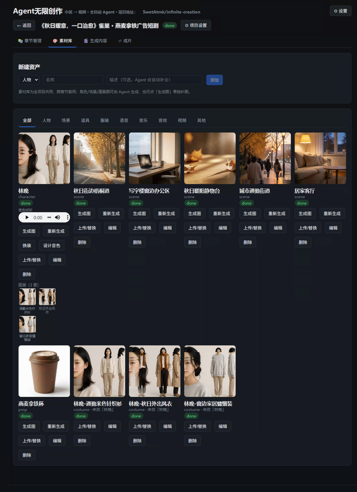
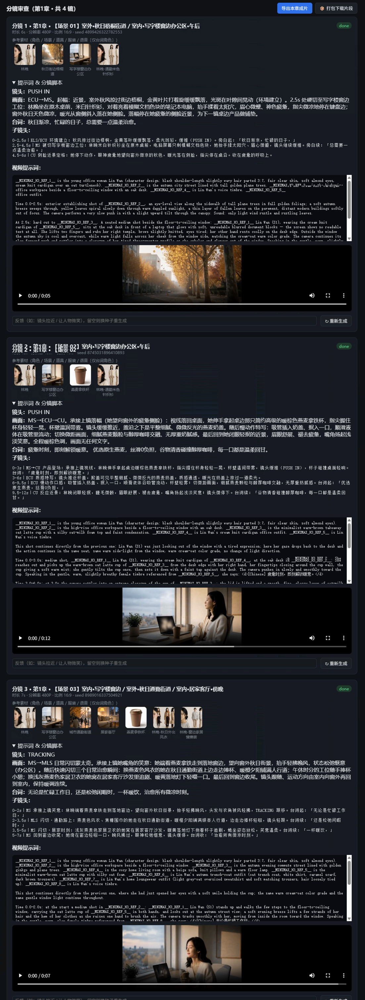

# 运行演示

## 输入内容
- 项目名称：《秋日暖意，一口治愈》燕麦拿铁广告短剧
- 画面风格：写实
- 章节原文：
```text
广告时长：30秒
风格定位：治愈、清新、生活化、秋冬氛围感
核心卖点：0负担植物燕麦、丝滑不腻、暖身治愈、适配日常疲惫时刻
人物：年轻上班族女生（日常简约穿搭，温柔松弛感）
分镜1（0-6s）：氛围感开篇·秋日疲惫
画面：近景，室外秋风拂过街边梧桐，黄叶缓缓飘落，镜头切至写字楼窗边，女生对着电脑揉太阳穴，屏幕满是文档，神色疲惫，指尖微微发凉，窗外天色微凉，光影柔和偏暖。
台词（女声轻缓独白）：秋日渐凉，忙碌的日子，总需要一点温柔治愈。
音效：轻柔秋风声、轻微键盘敲击声、舒缓钢琴前奏
字幕：秋风知凉意，暖心有甜柔
分镜2（7-13s）：产品登场·温暖解锁
画面：特写，女生伸手拿起桌边的新品燕麦拿铁，奶茶杯简约高级，暖棕色调适配秋日。指尖握住杯身，轻微晃动，杯壁温润。镜头拉近，展示平整细腻的奶盖，质感通透。
台词（女声）：疲惫时刻，即刻解锁暖意。
音效：轻微杯子碰撞桌面声、舒缓音乐递进
字幕：雀巢 · 燕麦拿铁 全新上线
分镜3（14-20s）：口感特写·核心卖点
画面：慢动作特写，吸管插入奶盖，抿入一口，顺滑液体流动质感。切换微观画面，细腻燕麦颗粒融合醇厚咖啡，无厚重奶腻感。女生闭眼轻抿，眉眼舒展，褪去疲惫，嘴角扬起浅淡笑意。
台词（女声）：优选原生燕麦，丝滑0负担，谷物清香碰撞醇厚咖啡，每一口都是温柔回甘。
音效：吸管吸食轻响、治愈舒缓背景音乐高潮段
字幕：谷物醇香｜丝滑不腻｜轻负担
分镜4（21-26s）：场景升华·日常适配
画面：中景，女生端着饮品走到窗边，望向窗外秋日街景，抬手轻拂晚风，状态松弛惬意。镜头快速闪切：通勤路上、午休时刻、居家追剧，不同场景下手持燕麦拿铁的治愈瞬间。
台词（女声）：无论是忙碌工作日，还是松弛闲暇时，一杯暖饮，治愈所有微凉时刻。
音效：轻快治愈旋律，氛围温暖松弛
字幕：适配每一个日常瞬间
分镜5（27-30s）：收尾定格·品牌露出
画面：产品全景定格，暖色调滤镜拉满，饮品置于秋日落叶、暖阳背景中，质感高级。画面下方浮现品牌LOGO、产品名称、限时活动标语。
台词（沉稳旁白收尾）：秋日暖心标配，雀巢 · 燕麦拿铁，予你每时每刻的温柔暖意。
音效：音乐轻柔收尾，清脆落音
字幕：雀巢饮品｜温暖相伴 不负秋日
```

## 输出结果

[查看演示视频：../images/秋日暖意_一口治愈_燕麦拿铁广告短剧_2fbee66e.mp4](../images/秋日暖意_一口治愈_燕麦拿铁广告短剧_2fbee66e.mp4)


## 页面截图
### 素材库

### 分镜审查

